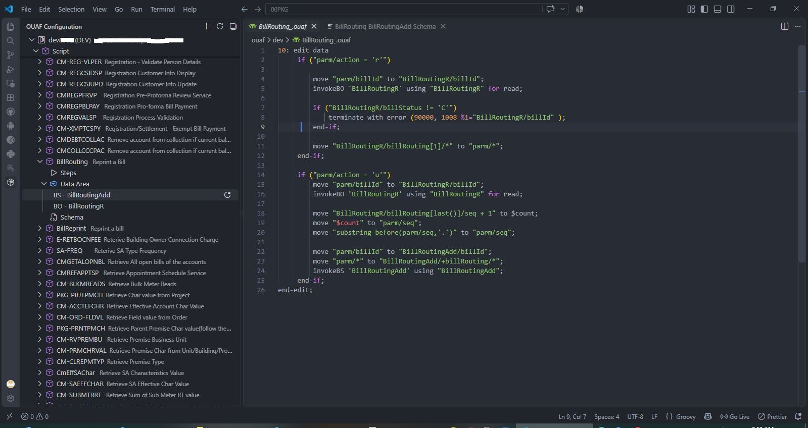
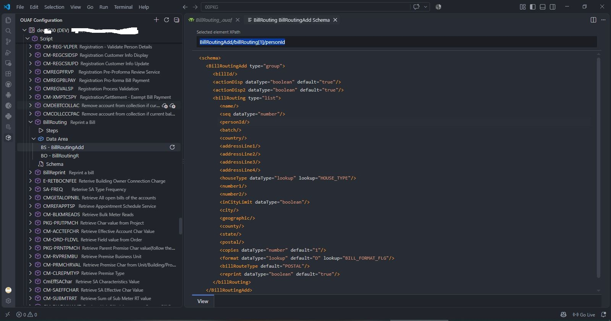
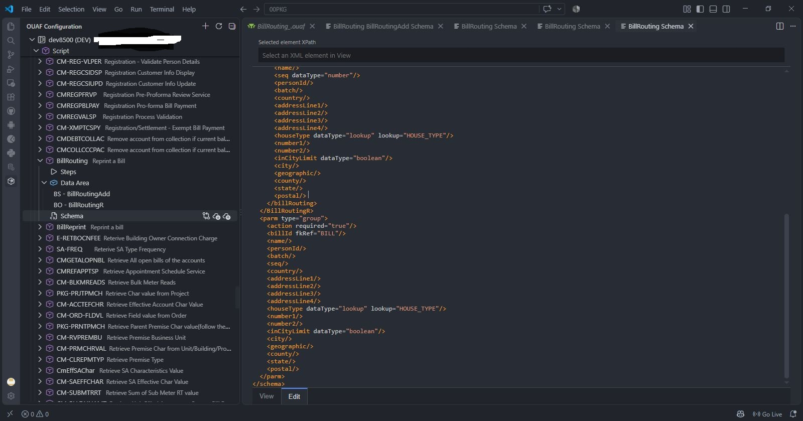
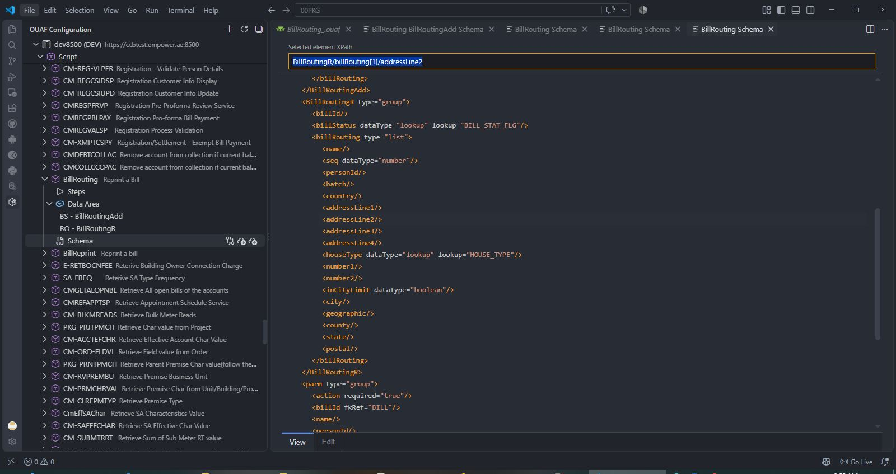
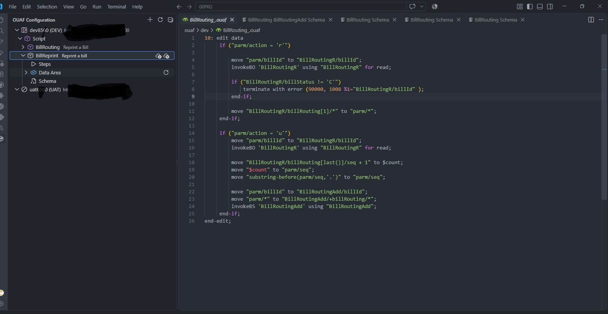
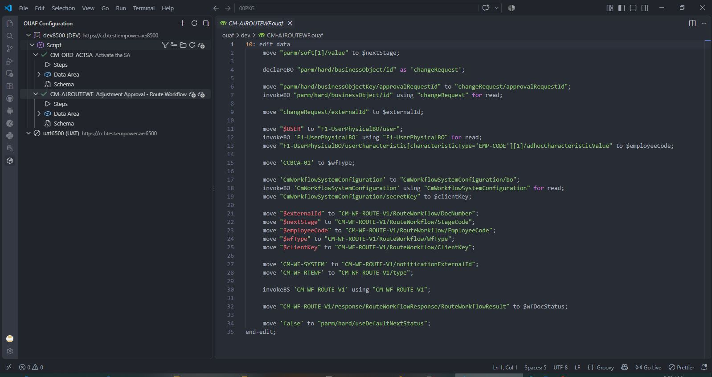

# OUAF Configuration Manager

OUAF Configuration Manager helps teams inspect and maintain Oracle Utilities Application Framework configuration from VS Code.

## Features

- Register Development, UAT, and Production environments with an API URL and Database connection.
- Browse Scripts from connected environments.
- Filter Scripts by code or description and select multiple Scripts in the explorer.
- Preserve Script filters and the "show only checked-out items" setting across refreshes and extension reloads.
- Check out one or more Scripts, or all Scripts matching the active filter, including Steps and Schema.
- Open Schema in a two-tab View/Edit panel. View shows a syntax-highlighted XML tree with selectable XPath elements and self-closing leaf elements such as `<emailId/>`; Edit provides an editable XML surface.
- Select an XML element to display its XPath, focus and select the XPath field, and copy the XPath automatically to the clipboard. List elements use a `[1]` XPath suffix.
- Save Schema edits with the normal editor save shortcut; switching back to View reflects the current XML content.
- Compare Steps or Schema from a local copy or server copy to a same-environment or target-environment server copy using VS Code's native diff editor.
- Replace local Steps from another environment without changing the local Schema.
- Check in by timestamping and removing active local copies, returning the Script to its server state.
- Show local and changed status indicators in the explorer.
- Connect or disconnect environments and collapse the explorer tree.
  

## OUAF Deployment Prerequisites

The extension requires supporting configuration and Java code to be installed in the OUAF application. The deployment artifacts are included in [`ouaf_package`](ouaf_package):

- [`CmOuafDevelopmentExtension_v1.sql`](ouaf_package/CmOuafDevelopmentExtension_v1.sql) configures the `CmScriptAsTextViewer` metadata, schema, and XAI service.
- [`CmScriptAsTextViewer.java`](ouaf_package/CmScriptAsTextViewer.java) implements the service used to retrieve Steps, Schema, and Data Area XML.

Before using the extension:

1. Confirm that the target OUAF application is Oracle Customer Care and Billing `v2.4.0.3` with Oracle Application Framework `v4.2.0.3`, or verify compatibility with your OUAF release.
2. Execute `CmOuafDevelopmentExtension_v1.sql` in the target OUAF application's database using an account permitted to update the OUAF configuration tables.
3. Deploy and compile `CmScriptAsTextViewer.java` in the target OUAF application according to the site's OUAF Java customization and application deployment process.
4. Restart or redeploy the OUAF application as required by that process, then verify that the `CmScriptAsTextViewer` XAI service is active.
5. Configure the extension with the matching OUAF API URL, authentication, and Oracle database connection, then test both API and database connectivity from the environment form.

The SQL script is configuration data for the OUAF database and is not executed by the VS Code extension. The Java file must be deployed to the OUAF application; copying it into the extension workspace alone is not sufficient. Take a database backup and follow your organization's change-control and deployment procedures before applying either artifact.

## Requirements

An OUAF API adapter and Oracle database access are required. The `oracledb` driver uses thin mode and does not require an Oracle Client installation for supported database versions.

To try it:

1. Run `npm install` and press `F5`.
2. Run **OUAF: Add Environment** for each environment.
3. Connect an environment, expand **Script**, and filter the available Scripts.
4. Filter Scripts or enable **Show Local Service Scripts**; these explorer choices are retained across refreshes and reloads.
5. Select one or more Scripts and use **Checkout Service Scripts**, or use it on the Script group to check out all filtered results. Checkout saves Steps and Schema without opening the files.
6. Expand **Data Area**, select a Data Area to inspect its XML in **View**, or open Schema to inspect it in **View** or edit it in **Edit**. Select an element to copy its XPath, then save Schema changes with the normal editor save shortcut.
7. Use the Steps or Schema actions to choose **Working copy vs Source**, **Working copy vs Target Environment**, or **Source vs Target Environment**, or replace Steps from another environment.
8. Commit generated `.ouaf` and `.xml` files with the normal Git integration in VS Code.

When the project is opened in another directory, the extension loads profiles from `.ouaf/environments.json`. Credentials are never written to that file and must be entered again on the new machine or VS Code profile. If a configured checkout directory is no longer valid, right-click the environment in the OUAF Explorer and choose **OUAF: Relocate Checkout Directory**.

## Extension Settings

- `ouaf-config-manager.defaultApiPath`: Default API path for new environments. Defaults to `/api/ouaf/config`.

## Local Files

Checked-out files are stored under `.ouaf/<environment>/serviceScript/` unless an environment-specific local directory is configured. Steps use `.ouaf`; Schema uses `.xml`. Filenames are based on the Script code, with unsupported characters sanitized and trailing underscores removed. Relative checkout directories are stored relative to the project so they remain valid after moving the project.

Check-in does not publish changes to OUAF. It archives active local files with a timestamped `.bak` suffix and removes the active local copies, allowing the explorer to return to the server state.

## Release Notes

### 0.1.0

Added environment profiles, OUAF component comparison, refresh, checkout, and local versioning workflow.
